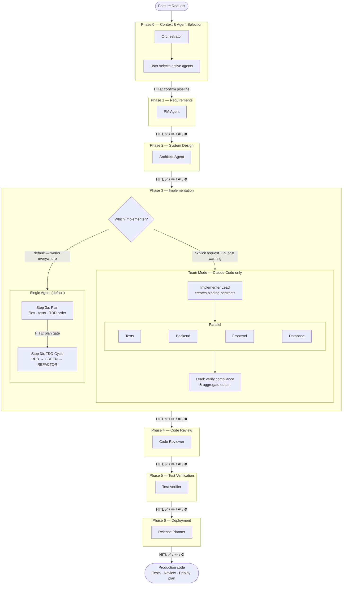

# Development Workflow

KAIROS is a **Human-in-the-Loop (HITL)** pipeline. Every phase produces a concrete artifact that the user validates before the next phase begins. The AI does the work; the human controls the gate.



At each HITL checkpoint the user can:
- ✅ **Approve** — continue to the next active agent
- ✏️ **Request changes** — agent revises and re-presents
- ⏭️ **Skip next** — approve this output, jump past the next active agent
- ⛔ **Stop** — abort the pipeline

Only selected agents run. Order is never changed.

---

## Phase 0: Context Extraction & Agent Selection

- Developer provides a natural-language feature request (with optional issue reference)
- Orchestrator reads the `## KAIROS Pipeline` section from the issue body (if present), or shows an interactive numbered list — **no automatic inference**
- User confirms or adjusts the agent selection; orchestrator announces the active pipeline before Phase 1

_Input: free-text feature request + optional issue reference_
_Output: confirmed `active_agents` list + `feature_folder` path_

::: tip Selective pipeline
Only agents explicitly selected in Phase 0 will run. Phases for inactive agents are skipped automatically. Use [Pipeline Templates](/setup/templates) to pre-configure agent selection in your issue tracker.
:::

---

## Phase 1: Requirements Analysis (PM Agent)

- Break down the feature into scope, constraints, and risks
- Identify edge cases and integration points
- Define acceptance criteria

_Input: feature description + project context_
_Output: structured JSON — scope, constraints, risks, success criteria_
_Saved to: `.kairos/<feature_folder>/01-requirements.json`_

::: info HITL checkpoint
User reviews requirements, constraints and risks before any design work begins.

`✅ Approve` · `✏️ Request changes` · `⏭️ Skip next` · `⛔ Stop`
:::

---

## Phase 2: System Design (Architect Agent)

- Propose 3 design options, recommend one
- Design database schema and API contracts
- Define error handling and integration patterns

_Input: PM analysis JSON_
_Output: architecture JSON — selected option, tech choices, DB changes, API contracts_
_Saved to: `.kairos/<feature_folder>/02-architecture.json`_

::: info HITL checkpoint
User reviews the selected design option and API contracts before any code is written.

`✅ Approve` · `✏️ Request changes` · `⏭️ Skip next` · `⛔ Stop`
:::

---

## Phase 3: Implementation

At the start of this phase, the Orchestrator routes to one of two modes based on the agent selection confirmed in Phase 0.

### Default: Implementer Agent

Works everywhere (Claude Code, API, local models). Recommended for all features.

This phase has **two HITL checkpoints** — a plan gate before any file is written, and a code gate after TDD is complete.

**Step 3a — Implementation Plan (no files written yet)**
- Analyse existing codebase patterns via `grep`
- Output structured plan: files to create/modify, full test case list, TDD order, dependencies, risks

**Step 3b — TDD Cycle (after plan approval)**
- Write tests FIRST (RED phase)
- Implement code to pass tests (GREEN phase)
- Refactor and verify coverage >80%

_Input: architecture JSON + project profile_
_Output: implementation plan → (approval) → code files + test files + coverage report_
_Saved to: project paths + `.kairos/<feature_folder>/03-implementation.json`_

::: info HITL checkpoint — Plan gate
User reviews the implementation plan (files, test cases, approach) **before any code is written**. Reject at zero cost.

`✅ Approve plan` · `✏️ Revise plan` · `⛔ Stop`
:::

::: info HITL checkpoint — Code gate
User reviews generated code and test coverage before the review phase.

`✅ Approve` · `✏️ Request changes` · `⏭️ Skip next` · `⛔ Stop`
:::

### Team Mode: Implementer Lead + 4 Teammates (Claude Code only, optional)

Activated only when explicitly requested. The Orchestrator shows a cost warning (~$0.068 single vs ~$0.242 team) and waits for confirmation before proceeding.

**How it works:**

1. **Implementer Lead** analyzes the Architect output and creates four binding contracts: API, database, test, and pattern contracts that all teammates must follow exactly
2. Four specialists execute **in parallel**:
   - **Teammate Tests** — generates the full test suite (RED phase first)
   - **Teammate Backend** — implements APIs per contract
   - **Teammate Frontend** — implements UI per contract
   - **Teammate Database** — creates schema and migrations per contract
3. **Implementer Lead** monitors contract compliance, flags mismatches, requests corrections, and aggregates all outputs

_Input: architecture JSON + project profile_
_Output: all layer files + contract compliance report + coverage report_
_Saved to: project paths + `.kairos/<feature_folder>/03-implementation.json`_

::: warning Team Mode — Claude Code only
Team Mode requires the ability for one agent to **spawn other agents programmatically at runtime**. Claude Code provides this via the native `agent` tool, which lets the Implementer Lead instantiate the four teammates in parallel during its own execution.

Other tools do not support this:

| Tool | Agent mechanism | Team Mode |
| --- | --- | --- |
| **Claude Code** | `agent` tool — an agent can spawn other agents at runtime | ✅ |
| **Cursor** | `@agent-name` — always user-triggered, never agent-triggered | ❌ |
| **VS Code Copilot** | `handoffs` — pre-defined transitions activated by the user | ❌ |
| **JetBrains / Codex CLI / others** | No agent-to-agent spawning mechanism | ❌ |

Use the single Implementer Agent in all non-Claude Code environments.
:::

::: tip When is Team Mode worth it?
Team Mode eliminates frontend/backend contract mismatches through binding contracts. It's worth the extra cost only for critical systems where perfect layer alignment cannot be verified manually. For the vast majority of features, the single agent is sufficient.
:::

---

## Phase 4: Code Review (Code Reviewer)

- Check standards, naming, file structure
- Verify security (no hardcoded secrets, input validation, auth checks)
- Verify architecture and API contract compliance
- Check performance (N+1 queries, memory leaks)

_Input: generated code + test files_
_Output: status READY or NEEDS\_FIXES + issues list with severity_
_Saved to: `.kairos/<feature_folder>/04-review.json`_

::: info HITL checkpoint
User reviews quality report. NEEDS\_FIXES sends the issue list back to the Implementer.

`✅ Approve` · `✏️ Request changes` · `⏭️ Skip next` · `⛔ Stop`
:::

---

## Phase 5: Test Verification (Test Verifier)

- Verify test comprehensiveness (edge cases, error scenarios)
- Check coverage adequacy (>80% required)
- Assess assertion quality

_Input: test code + coverage report_
_Output: coverage status PASS/FAIL + quality assessment + gaps_
_Saved to: `.kairos/<feature_folder>/05-test-verification.json`_

::: info HITL checkpoint
User confirms coverage is adequate. FAIL sends gap list back to the Implementer.

`✅ Approve` · `✏️ Request changes` · `⏭️ Skip next` · `⛔ Stop`
:::

---

## Phase 6: Deployment Planning (Release Planner)

- Define deployment steps (pre-checks → staging → canary 10% → full rollout)
- Create rollback strategy with estimated time
- Define monitoring metrics and alert thresholds

_Input: verified code + architecture + identified risks_
_Output: deployment plan JSON — steps, risk mitigation, rollback, monitoring_
_Saved to: `.kairos/<feature_folder>/06-deployment-plan.json`_

::: info HITL checkpoint
User approves the deployment plan. This is the final checkpoint — approval closes the KAIROS run.

`✅ Approve` · `✏️ Request changes` · `⛔ Stop`
:::

---

## Issue Tracker Integration

KAIROS supports **Jira**, **GitLab Issues**, and **Bitbucket Issues**. Provide an issue reference at the start of your request — each agent will post its validated output as a comment, building the full pipeline trace in the ticket history.

| Tracker | Reference format | Example |
|---------|-----------------|--------|
| Jira | `PROJ-42` | `"Add Stripe payments — PROJ-42"` |
| GitLab | `#42` | `"Add Stripe payments — issue #42"` |
| Bitbucket | `#42` | `"Add Stripe payments — issue #42"` |

```bash
# Jira (jira-cli):
jira issue comment add PROJ-42 "## PM Analysis\n\n..."
jira issue comment add PROJ-42 "## Architecture Design\n\n..."

# GitLab (glab):
glab issue note 42 --body "## PM Analysis\n\n..."

# Bitbucket (REST API):
curl -X POST "https://api.bitbucket.org/2.0/repositories/{workspace}/{repo}/issues/42/comments" \
  -u "${BITBUCKET_USER}:${BITBUCKET_TOKEN}" \
  -H "Content-Type: application/json" \
  -d '{"content":{"raw":"## PM Analysis\n\n..."}}"
```

---

## Error Handling

If any agent reports issues during its phase, the Orchestrator:

1. Flags the problem to the user
2. Asks whether to retry, skip, or abort the step
3. Provides recommendations based on severity
4. Continues to the next step when appropriate

---

## Final Output

After all phases complete, the Orchestrator presents a consolidated summary:

```
ANALYSIS (from PM Agent):
  - Scope, Constraints, Risks, Success Criteria

ARCHITECTURE (from Architect Agent):
  - Design Option Selected, Technology Choices
  - Integration Points, Database Changes, API Contracts

IMPLEMENTATION (from Implementer Agent):
  - Code Files Generated, Test Files Generated
  - Coverage Report, TDD Verification

QUALITY (from Code Reviewer):
  - Standards Compliance, Security Check
  - Performance Analysis, Issues Found (if any)

TEST QUALITY (from Test Verifier):
  - Coverage Status, Test Quality Assessment
  - Missing Coverage (if any)

DEPLOYMENT (from Release Planner):
  - Deployment Steps, Risk Mitigation
  - Rollback Strategy, Monitoring Plan
```

::: tip Every KAIROS run produces
- Production-ready code
- Comprehensive test suite (>80% coverage)
- Quality assurance report
- Deployment plan with rollback procedure
:::
