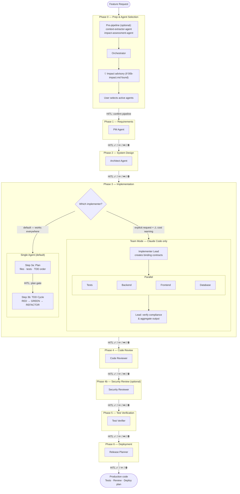

# Development Workflow

KAIROS is a **Human-in-the-Loop (HITL)** pipeline. Every phase produces a concrete artifact that the user validates before the next phase begins. The AI does the work; the human controls the gate.


```mermaid
flowchart TD
    A([Feature Request]) --> P0

    subgraph P0["Phase 0 — Prep & Agent Selection"]
        direction TB
        PRE["Pre-pipeline (optional):
context-extractor-agent
impact-assessment-agent"] --> O
        O[Orchestrator] --> ADV["💡 Impact advisory (if 00b-impact.md found)"]
        ADV --> SEL[User selects active agents]
    end

    P0 -->|HITL: confirm pipeline| P1

    subgraph P1["Phase 1 — Requirements"]
        PM[PM Agent]
    end

    P1 -->|"HITL ✅ / ✏️ / ⏭️ / ⛔"| P2

    subgraph P2["Phase 2 — System Design"]
        ARCH[Architect Agent]
    end

    P2 -->|"HITL ✅ / ✏️ / ⏭️ / ⛔"| P3

    subgraph P3["Phase 3 — Implementation"]
        direction TB
        ROUTE{Which implementer?}
        ROUTE -->|default — works everywhere| SA
        ROUTE -->|"explicit request + ⚠️ cost warning"| TM

        subgraph SA["Single Agent (default)"]
            direction TB
            PLAN["Step 3a: Plan
files · tests · TDD order"]
            PLAN -->|"HITL: plan gate"| TDD
            TDD["Step 3b: TDD Cycle
RED → GREEN → REFACTOR"]
        end

        subgraph TM["Team Mode — Claude Code only"]
            direction TB
            LEAD["Implementer Lead
creates binding contracts"]
            LEAD --> PAR
            subgraph PAR["Parallel"]
                direction LR
                T1[Tests] ~~~ T2[Backend] ~~~ T3[Frontend] ~~~ T4[Database]
            end
            PAR --> AGG["Lead: verify compliance
& aggregate output"]
        end
    end

    P3 -->|"HITL ✅ / ✏️ / ⏭️ / ⛔"| P4

    subgraph P4["Phase 4 — Code Review"]
        REV[Code Reviewer]
    end

    P4 -->|"HITL ✅ / ✏️ / ⏭️ / ⛔"| P4B

    subgraph P4B["Phase 4b — Security Review (optional)"]
        SR[Security Reviewer]
    end

    P4B -->|"HITL ✅ / ✏️ / ⏭️ / ⛔"| P5

    subgraph P5["Phase 5 — Test Verification"]
        TV[Test Verifier]
    end

    P5 -->|"HITL ✅ / ✏️ / ⏭️ / ⛔"| P6

    subgraph P6["Phase 6 — Deployment"]
        RP[Release Planner]
    end

    P6 -->|"HITL ✅ / ✏️ / ⛔"| OUT(["Production code
Tests · Review · Deploy plan"])
```

Each HITL checkpoint is an interactive prompt (Claude Code's `AskUserQuestion` tool), not a text menu to reply to. Before it, if the phase's output has a Risks/Issues/Findings table with any row left undispositioned, the **Risk Disposition Loop** walks through those rows first — one at a time (or up to 4 per prompt), with **Accept / Mitigate now / Escalate / Defer** — instead of forcing an approve-or-reject on the whole table at once. Only once every row has a disposition does the whole-artifact gate below appear; it marks one option as recommended based on the phase's own status (an unresolved Escalate biases it toward Request changes), and always leaves a free-text option for detailed feedback:
- ✅ **Approve** — continue to the next active agent
- ✏️ **Request changes** — agent revises and re-presents
- ⏭️ **Skip next** — approve this output, jump past the next active agent
- ⛔ **Stop** — abort the pipeline

Only selected agents run. Order is never changed.

### Artifact Format — Markdown + Frontmatter

Every phase writes a single Markdown file: a small YAML frontmatter header (status, counts, `next_agent` — what the orchestrator branches on) followed by the report body (data model tables, issues lists, findings, runbooks — what the human actually reads at the gate). Nothing in this pipeline parses these files with real code — every consumer is either the next agent reading it as prompt text or a human at a gate — so a full schema or a long issues list is plain Markdown, not JSON: unreadable as nested JSON, but a table that scans in seconds. Any Risks/Issues/Findings table carries a `Disposition` column, left empty by the agent and filled in by the Risk Disposition Loop above.

---

## Phase 0: Prep & Agent Selection

**Pre-pipeline (optional, both standalone):**
- Run `@context-extractor-agent` first to produce `00-context.md` (full-repo scan — stack, patterns, conventions)
- Run `@impact-assessment-agent` to produce `00b-impact.md` (issue-scoped grounding — effort, domains, recommended agents). Consumes `00-context.md` if present; does not rescan what it already covers. `test-verifier-agent` is only recommended when a TDD implementer is selected AND effort is `medium` or `significant_rework` — a `simple_fix` on the TDD path relies on `code-reviewer-agent`'s own Testing check instead of a dedicated verification phase.

**Pipeline start:**
- Developer provides a natural-language feature request (with optional issue reference)
- Orchestrator loads `00-context.md` and `00b-impact.md` if present
- **Quick-Fix Check** (skipped only when a `## KAIROS Pipeline` template section was found in the issue body): one question — "Quick fix, or full feature?" Quick fix presets `active_agents` to `implementer-coder-agent` + `code-reviewer-agent`, sets `loop_policy` to `auto 1`, and widens the Risk Disposition Loop's auto-accept threshold to `medium` for this run — skipping the full selection menu and the loop-policy prompt below entirely. Full feature proceeds as before.
- If `00b-impact.md` found, displays a `💡 Impact Assessment` advisory block before the selection menu (effort, domains, recommended agents) — advisory only, nothing pre-selected
- Orchestrator reads the `## KAIROS Pipeline` section from the issue body (if present), or shows an interactive numbered list — **no automatic inference**
- User confirms or adjusts the agent selection; orchestrator announces the active pipeline before Phase 1

_Input: free-text feature request + optional issue reference + optional pre-pipeline JSON files_
_Output: confirmed `active_agents` list + `feature_folder` path_

::: tip Selective pipeline
Only agents explicitly selected in Phase 0 will run. Phases for inactive agents are skipped automatically. Use [Pipeline Templates](/setup/templates) to pre-configure agent selection in your issue tracker.
:::

::: tip Quick-Fix Check trades TDD discipline for speed
Choosing "Quick fix" routes to `implementer-coder-agent` (no TDD cycle, no `test-verifier-agent` phase) even in a repo with a test suite. If you want tests generated for a small change, pick "Full feature" or hand-pick `implementer-tdd-agent` from the selection menu instead.
:::

---

## Phase 1: Requirements Analysis (PM Agent)

- Break down the feature into scope, constraints, and risks
- Identify edge cases and integration points
- Define acceptance criteria

_Input: feature description + project context_
_Output: structured JSON — scope, constraints, risks, success criteria_
_Saved to: `.kairos/<feature_folder>/01-requirements.md`_

::: info HITL checkpoint
User reviews requirements, constraints and risks before any design work begins. Presented via `AskUserQuestion`, not a printed menu.

`✅ Approve` · `✏️ Request changes` · `⏭️ Skip next` · `⛔ Stop`
:::

---

## Phase 2: System Design (Architect Agent)

- Propose 3 design options, recommend one
- Design database schema and API contracts
- Define error handling and integration patterns

_Input: PM analysis JSON_
_Output: a single Markdown file — frontmatter (selected option, table/error-code counts) + design doc body (full data model, API contracts, tech choices) — see "Artifact Format" above_
_Saved to: `.kairos/<feature_folder>/02-architecture.md` + `.kairos/<feature_folder>/02-architecture.md`_

::: info HITL checkpoint
User reviews the selected design option and API contracts (in `02-architecture.md`) before any code is written. Presented via `AskUserQuestion`, not a printed menu.

`✅ Approve` · `✏️ Request changes` · `⏭️ Skip next` · `⛔ Stop`
:::

---

## Phase 3: Implementation

At the start of this phase, the Orchestrator routes to one of two modes based on the agent selection confirmed in Phase 0.

### Default: Implementer Agent

Works everywhere (Claude Code, API, local models). Recommended for all features.

This phase has **two HITL checkpoints** — a plan gate before any file is written, and a code gate after TDD is complete.

**Step 3a — Implementation Plan (no files written yet)**
- Analyse existing codebase patterns via `grep`
- Output structured plan: files to create/modify, full test case list, TDD order, dependencies, risks

**Step 3b — TDD Cycle (after plan approval)**
- Write tests FIRST (RED phase)
- Implement code to pass tests (GREEN phase)
- Refactor and verify coverage >80%

_Input: architecture JSON + project profile_
_Output: implementation plan → (approval) → code files + test files + coverage report_
_Saved to: project paths + `.kairos/<feature_folder>/03-implementation.md`_

::: info HITL checkpoint — Plan gate
User reviews the implementation plan (files, test cases, approach) **before any code is written**. Reject at zero cost. Presented via `AskUserQuestion`, not a printed menu.

`✅ Approve plan` · `✏️ Revise plan` · `⛔ Stop`
:::

::: info HITL checkpoint — Code gate
User reviews generated code and test coverage before the review phase. Presented via `AskUserQuestion`, not a printed menu.

`✅ Approve` · `✏️ Request changes` · `⏭️ Skip next` · `⛔ Stop`
:::

### Team Mode: Implementer Lead + 4 Teammates (Claude Code only, optional)

Activated only when explicitly requested. The Orchestrator shows a cost warning (~$0.068 single vs ~$0.242 team) and waits for confirmation before proceeding.

**How it works — TDD across a team:**

The Lead applies the same RED → GREEN → REFACTOR discipline as the single agent, but distributes the work across specialists with an additional HITL gate between RED and GREEN:

1. **Lead** analyzes Architect output and defines four binding contracts (API, database, test, pattern) before any teammate starts
2. **RED phase** — Lead spawns `teammate-tests-agent` first. Tests are written against the contracts before any implementation exists. All tests fail — this is correct and expected.
3. **HITL — Test Plan Gate** — User reviews the test suite before any implementation is spawned. Reject or revise at zero cost.
4. **GREEN phase** — Lead spawns `teammate-backend-agent`, `teammate-frontend-agent`, `teammate-database-agent` in parallel. Their goal is to make the pre-existing tests pass.
5. **REFACTOR phase** — Lead coordinates quality improvements across all layers while keeping tests green.
6. **Lead** monitors contract compliance throughout, flags mismatches, and aggregates the final output.

_Input: architecture JSON + project profile_
_Output: all layer files + contract compliance report + coverage report_
_Saved to: project paths + `.kairos/<feature_folder>/03-implementation.md`_

::: warning Team Mode — Claude Code only (experimental)
Team Mode requires **Claude Code's experimental Agent Teams feature**. Enable it by setting `CLAUDE_CODE_EXPERIMENTAL_AGENT_TEAMS=1` in `.claude/settings.json`. Requires Claude Code v2.1.32+.

Unlike the single Implementer Agent (which uses the `agent` tool for direct subagent spawning), Agent Teams run each teammate as a **separate Claude Code session** with its own context window. Teammates communicate peer-to-peer via a shared mailbox and coordinate via a shared task list — not just reporting back to the lead.

| Tool | Agent Teams support | Team Mode |
| --- | --- | --- |
| **Claude Code v2.1.32+** | Experimental Agent Teams — separate sessions, peer messaging | ✅ |
| **Cursor** | No inter-session coordination | ❌ |
| **VS Code Copilot** | No inter-session coordination | ❌ |
| **JetBrains / Codex CLI / others** | No inter-session coordination | ❌ |

Use the single Implementer Agent in all non-Claude Code environments.
:::

::: tip When is Team Mode worth it?
Team Mode eliminates frontend/backend contract mismatches through binding contracts. It's worth the extra cost only for critical systems where perfect layer alignment cannot be verified manually. For the vast majority of features, the single agent is sufficient.
:::

---

## Phase 4: Code Review (Code Reviewer)

- Check standards, naming, file structure
- Verify security (no hardcoded secrets, input validation, auth checks)
- Verify architecture and API contract compliance
- Check performance (N+1 queries, memory leaks)

_Input: generated code + test files_
_Output: a single Markdown file — frontmatter (status, pass/fail checks, issue counts) + report body (full issues table with impact, file:line, description, fix, disposition)_
_Saved to: `.kairos/<feature_folder>/04-review.md` + `.kairos/<feature_folder>/04-review.md`_

::: info HITL checkpoint
User reviews the quality report (`04-review.md`). NEEDS\_FIXES sends the issues table back to the Implementer. Presented via `AskUserQuestion`, not a printed menu.

`✅ Approve` · `✏️ Request changes` · `⏭️ Skip next` · `⛔ Stop`
:::

::: tip Lean Mode for simple fixes
When `effort: simple_fix` (from `00b-impact.md`, or self-inferred standalone), Architecture Compliance and Performance collapse to a one-line N/A unless the diff actually adds an endpoint/schema/integration point or touches a loop/query/hot path; the dependency-changelog check only runs when a dependency version actually changed. Correctness, Security, Simplicity, and Standards always run in full — those are what actually catch bugs on a small diff.
:::

---

## Phase 4b: Security Review — optional (Security Reviewer)

Adversarial pass — the agent asks "how do I break this" rather than checking compliance boxes. Only runs when explicitly selected. Read-only agent (`model: opus`).

- **Authorization and IDOR** — including nested payload mutations (a PUT on parent A that can silently modify a child belonging to parent B)
- **Authentication** on sensitive endpoints
- **Injection** — SQL, command, template, NoSQL
- **Secret handling** — hardcoded creds, secrets in logs or responses
- **Data over-exposure** — full model serialization, unfiltered list endpoints
- **Input validation** at the server boundary
- **Dependency risks** — known CVEs, deprecated crypto
- **Contract enforcement** — verifies that ownership constraints from `02-architecture.md` are actually present in code; gaps are flagged regardless of direct exploitability

_Input: implementation code + `02-architecture.md` / `02-architecture.md`_
_Output: a single Markdown file — frontmatter (status, finding counts) + report body (each finding's attack scenario, evidence, fix, and disposition; contract enforcement table)_
_Saved to: `.kairos/<feature_folder>/04b-security-review.md` + `.kairos/<feature_folder>/04b-security-review.md`_ (both written by Orchestrator — agent is read-only)

::: info HITL checkpoint
User reviews findings in `04b-security-review.md`. "Request fixes" forwards the Findings section to the Implementer. Presented via `AskUserQuestion`, not a printed menu.

`✅ Approve` · `✏️ Request fixes` · `⏭️ Skip next` · `⛔ Stop`
:::

::: tip When to add the Security Reviewer
Select `security-reviewer-agent` whenever the feature touches: authentication or authorization, user-owned data, payment flows, or any write endpoint. KAIROS's own flagship example (PCI-DSS Stripe payments) is a clear case.
:::

---

## Phase 5: Test Verification (Test Verifier)

- Verify test comprehensiveness (edge cases, error scenarios)
- Check coverage adequacy (>80% required)
- Assess assertion quality

_Input: test code + coverage report_
_Output: a single Markdown file — frontmatter (status, execution/coverage summary) + report body (uncovered lines, AC mapping, issues table)_
_Saved to: `.kairos/<feature_folder>/05-test-verification.md` + `.kairos/<feature_folder>/05-test-verification.md`_

::: info HITL checkpoint
User confirms coverage is adequate from `05-test-verification.md`. FAIL sends the gap/issues table back to the Implementer. Presented via `AskUserQuestion`, not a printed menu.

`✅ Approve` · `✏️ Request changes` · `⏭️ Skip next` · `⛔ Stop`
:::

::: tip Skips re-running tests on a clean first pass
`implementer-tdd-agent` already executes the test suite twice (RED and GREEN) and reports coverage in `03-implementation.md`. On the first test-verifier invocation for a feature — no prior `05-test-verification.md`, and GREEN shows a clean pass — Test Verifier reuses those results instead of re-running the suite. The static audit (comprehensiveness, assertion strength, determinism, hygiene, mocking, TDD reality check) always runs in full regardless; only the redundant command re-run is skipped. Any loop re-check, Guard regression check, or standalone invocation always re-executes.
:::

---

## Phase 6: Deployment Planning (Release Planner)

- Define deployment steps (pre-checks → staging → canary 10% → full rollout)
- Create rollback strategy with estimated time
- Define monitoring metrics and alert thresholds

_Input: verified code + architecture + identified risks_
_Output: a single Markdown file — frontmatter (rollback/monitoring summary) + runbook body (deployment steps, risk mitigation table, rollback checklist, monitoring)_
_Saved to: `.kairos/<feature_folder>/06-deployment-plan.md` + `.kairos/<feature_folder>/06-deployment-plan.md`_

::: info HITL checkpoint
User approves the deployment runbook (`06-deployment-plan.md`). This is the final checkpoint of the numbered pipeline — approval closes this KAIROS run (Phases 1–6, or 1–6b if `documentation-agent` was also selected). It does not preclude running `retrospective-agent` afterward — a separate, standalone, non-orchestrated follow-up invoked directly by the user whenever they consider the feature done. Presented via `AskUserQuestion`, not a printed menu.

`✅ Approve` · `✏️ Request changes` · `⛔ Stop`
:::

---

## Shared Ledger — Cross-Phase Project Memory

Each KAIROS run maintains three living files under `.kairos/<feature_folder>/ledger/` that accumulate shared state across all phases:

| File | Purpose | Seeded by | Updated by |
|------|---------|-----------|-----------|
| `constraints.md` | All constraints with per-phase accounting | PM Agent (or Context Extractor if run first) | Every agent |
| `decisions.md` | Architectural and implementation decisions log | Architect Agent | Any agent |
| `open-questions.md` | Cross-phase questions with answers | Any agent or human (via HITL gate) | Any agent |

### How the ledger works

**Forced accounting model** — at the end of every phase, each agent must update the Status column of every existing constraint row before adding new ones. An unaddressed constraint stays `🔴 open` and is visible to every downstream agent.

| Status | Meaning |
|--------|---------|
| `🔴 open` | Not yet addressed by any agent |
| `✓ resolved` | Constraint is satisfied — note how |
| `⚠ deferred` | Acknowledged but deferred (tracked in risk) |
| `♻ modified` | Constraint was changed — note new version |
| `❌ dropped` | Explicitly removed — note justification |

### Why this matters

Without the ledger, information can be silently dropped between phases: a SOC2 compliance constraint captured by the PM but not echoed into `02-architecture.md` is invisible to the Implementer and Reviewer. The ledger eliminates this by making all cross-phase constraints and decisions explicit and persistent.

**Constraint & Decision Conflict Scan** — after every phase's own ledger update, the Orchestrator re-reads `constraints.md` and `decisions.md` and checks this phase's actual output against every row an *earlier* phase already resolved or recorded. A row's own Status cell only records what the acting agent *claims* happened — it never cross-checks itself against constraints or decisions from more than one phase back — so this is the only place that drift gets caught. A genuine contradiction becomes a `high`-impact row in the phase's own Risks/Issues table, resolved through the same HITL gate as everything else there.

At pipeline end, the Orchestrator counts `🔴 open` items in `open-questions.md` and warns if any remain unresolved before shipping.

> **Team Mode**: only `implementer-lead-agent` reads and writes the ledger. Teammates receive constraints through their binding contracts, not by direct ledger access.

---

## Issue Tracker Integration

KAIROS supports **Jira**, **GitLab Issues**, and **Bitbucket Issues**. Provide an issue reference at the start of your request — each agent will post its validated output as a comment, building the full pipeline trace in the ticket history.

| Tracker | Reference format | Example |
|---------|-----------------|--------|
| Jira | `PROJ-42` | `"Add Stripe payments — PROJ-42"` |
| GitLab | `#42` | `"Add Stripe payments — issue #42"` |
| Bitbucket | `#42` | `"Add Stripe payments — issue #42"` |

```bash
# Jira (jira-cli):
jira issue comment add PROJ-42 "## PM Analysis\n\n..."
jira issue comment add PROJ-42 "## Architecture Design\n\n..."

# GitLab (glab):
glab issue note 42 --body "## PM Analysis\n\n..."

# Bitbucket (REST API):
curl -X POST "https://api.bitbucket.org/2.0/repositories/{workspace}/{repo}/issues/42/comments" \
  -u "${BITBUCKET_USER}:${BITBUCKET_TOKEN}" \
  -H "Content-Type: application/json" \
  -d '{"content":{"raw":"## PM Analysis\n\n..."}}"
```

---

## Error Handling

If any agent reports issues during its phase, the Orchestrator:

1. Flags the problem to the user
2. Asks whether to retry, skip, or abort the step
3. Provides recommendations based on severity
4. Continues to the next step when appropriate

---

## Final Output

After all phases complete, the Orchestrator presents a consolidated summary:

```
ANALYSIS (from PM Agent):
  - Scope, Constraints, Risks, Success Criteria

ARCHITECTURE (from Architect Agent):
  - Design Option Selected, Technology Choices
  - Integration Points, Database Changes, API Contracts

IMPLEMENTATION (from Implementer Agent):
  - Code Files Generated, Test Files Generated
  - Coverage Report, TDD Verification

QUALITY (from Code Reviewer):
  - Standards Compliance, Security Check
  - Performance Analysis, Issues Found (if any)

SECURITY (from Security Reviewer):
  - Findings ranked by exploitable severity
  - Attack scenarios
  - Contract enforcement status (ownership constraints verified)
  - IDOR / ownership gaps

TEST QUALITY (from Test Verifier):
  - Coverage Status, Test Quality Assessment
  - Missing Coverage (if any)

DEPLOYMENT (from Release Planner):
  - Deployment Steps, Risk Mitigation
  - Rollback Strategy, Monitoring Plan
```

::: tip Every KAIROS run produces
- Production-ready code
- Comprehensive test suite (>80% coverage)
- Quality assurance report
- Deployment plan with rollback procedure
:::
